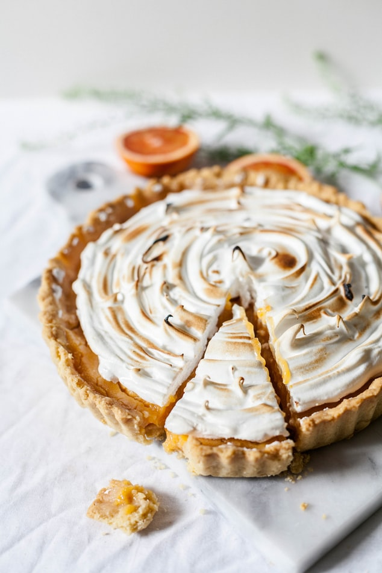
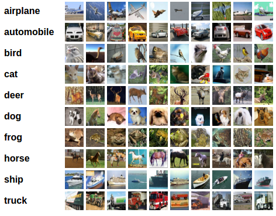
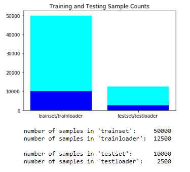
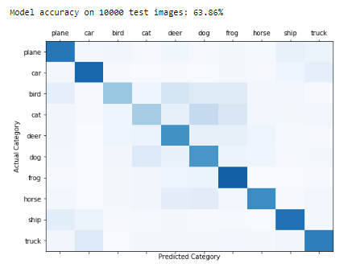
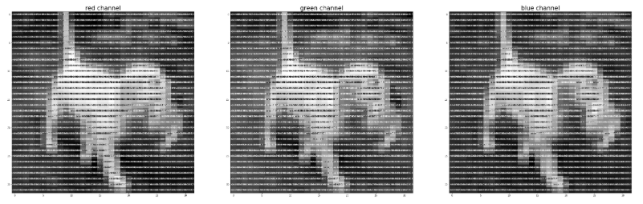
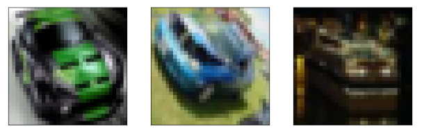
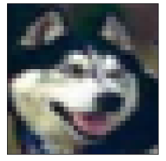

# Module 4 Final Project

*A torched pie*

## Using PyTorch to Identify Model Influences
This project explores a machine learning package designed to identify which training data exert the most influence over a neural network models outcomes. It is based on the [nimarb](https://github.com/nimarb) reimplementation of Influence Functions from the ICML2017 best paper: [Understanding Black-box Predictions via Influence Functions](https://arxiv.org/abs/1703.04730) by Pang Wei Koh and Percy Liang. The reference implementation can be found here: [link](https://github.com/kohpangwei/influence-release).

## The Dataset

The project makes use of the CIFAR-10 image dataset, which consists of 50000 training images and 10000 test images in 10 classes.

## Objectives

The stock in trade of machine learning (ML) practitioners is the development and interpretation of ML models and what those models say about the data upon which they operate. Models can tell us the best place and time to plant a crop, whether or not a chest x - ray indicates the presence of disease, or the types of video entertainment most likely to sustain a new studio enterprise. Machine algorithms have become important factors in the decision - making process across numerous domains. Self - driving cars rely on them, for street sign recognition. Real estate developers use them to identify areas ripe for profitable development. Think tanks leverage them to predict and to recommend options for avoiding or mitigating widespread hunger.

In addition to analyzing what an ML model can tell us about our data, of increasing interest is identifying what training data can tell us about our model. It has been argued that bias - free ML models do not exist. This is a reasonable assumption, considering the fact that training data is finite and cannot possibly represent all possible outcomes. Data may also be vulnerable to basic error, such as incorrect labeling. So, it is a useful undertaking to consider what features of training data, when only slightly altered, can flip the outcome of a model prediction.

Toward such an endeavor, the Influence Function package for PyTorch, a deep learning library for Python, provides a method by which ML practitioners may gain insight into factors that effect outsized influence over data classification.

This project explores implementation of the PyTorch Influence Function package on a Deep Neural Network model, for image classification to find out which images have the greatest positive and negative impact on the model's classification predictions.

#### Data Preparation



We load CIFAR-10 (32 x 32 pixel rgb images) into our project notebook using PyTorch's torchvision package.

```
# def load_data():
transform = transforms.Compose(
    [transforms.ToTensor(),
     transforms.Normalize((0.5, 0.5, 0.5), (0.5, 0.5, 0.5))])

trainset = torchvision.datasets.CIFAR10(root='./data', train=True,
                                        download=True, transform=transform)
trainloader = torch.utils.data.DataLoader(trainset, batch_size=4,
                                          shuffle=True, num_workers=2)

testset = torchvision.datasets.CIFAR10(root='./data', train=False,
                                       download=True, transform=transform)
testloader = torch.utils.data.DataLoader(testset, batch_size=4,
                                         shuffle=False, num_workers=2)
```
In addition to many popular datasets, torchvision contains transforms. Scrubbing the dataset involved using these transforms to convert our data arrays to PyTorch Tensors (which can be run on a GPU) and to normalize the data.



Data were then shuffled into randomized batches, for the training set.

#### Modeling

The model was built using architecture from the [nimarb](https://github.com/nimarb) reimplementation of Influence Functions. Keep in mind that our goal was not to design a perfect model; practically any model would do. Our interest is in the capability for PyTorch's influence function package to identify inputs that have outsized influence over the model's overall accuracy, for better or for worse.



> PyTorch facilitates the creation of neural networks as modules, with layers and propagation defined as python functions.
We deconstructed model training, along with functions to save, load, and test on the model, to work in - notebook.

#### Evaluation

As an example of the ways that machines 'view' images, we plot each rgb channel of an image in grayscale with annotations, to visualize the brightness values for each pixel in each of the 3 channels.

*Dog image RGB channels in grayscale*

PyTorch's influence function package analyzes images whose gradients significantly impact the overall outcomes of the model (model accuracy) , calculating which images were most harmful and which were most helpful.

\
*The three images found most harmful to the model*

FULL DISCLOSURE: This project marks my first time using PyTorch and Influence Functions.

Altering weights within the model for these influential image features, can help us to see how we can improve accuracy for the related classes. Alternately, we could 'stress - test' our model, to identify how it might be undermined via minor changes (perturbations) to image data.

Applications for influence functions may include the following:
* Verifying data labels, to prevent mis - labeled data from compromising the integrity of models.
* Robustly authenticating valuables or even identity, without being overly - reliant on a few influential features
* De - bugging in practically any domain that uses ML models

For the record: influence functions found this image of a 'smiling' canine to be one of the most helpful:
\
*Helpful hound*

Yes. Yes, you are.

# Featured Notebooks/Analysis

* [`student`: **Jupyter Notebook**](student.ipynb): containing code written for this project and comments explaining it.

### Non-Technical Presentation

* ['presentation.pdf'](presentation.pdf) summarizing  methodology, findings, and future work

# Technologies
* framework: Jupyter Notebook
* languages: Python
* libraries and modules:
  - CUDA
  - Numpy
  - OS
  - PyTorch:
    * pytorch-influence-functions
    * torchvisio
    * torch.nn
    * torch.optim
  - Sys
* visualization libraries
  - Matplotlib


```python

```
